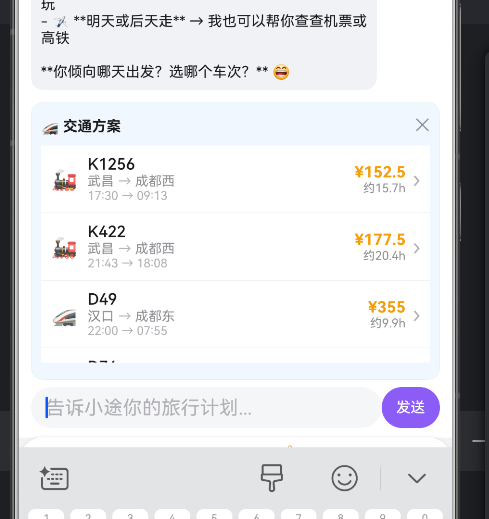
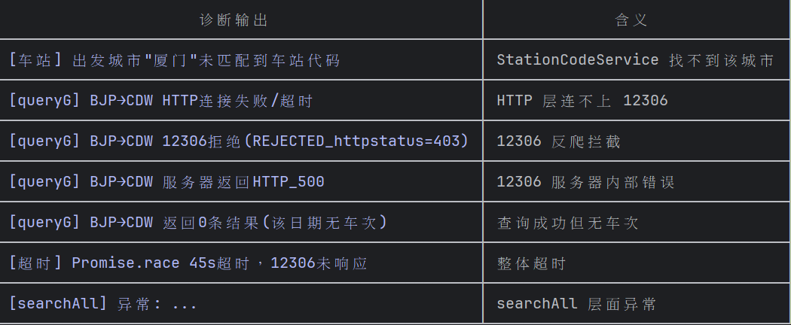
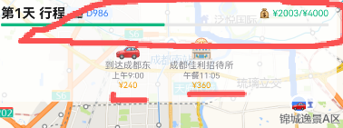

# 笔记：
- 初始信息：目的地，出发地，出发时间，游玩天数，经费

# 处理中：
- 工具错误原因不明，更多错误标记
- ~~日程插入混乱，不应该用上午下午这种强行卡死时间，应该根据在场景的开销时间+路上开销来推算时间够不够和能不能插入进去~~
- “日程”顺序混乱！
- 小城市站名是编号而不是中文

# bug：
- 工具运行途中清理对话会错误！！
- 有时候地图上没有刚到和离开的火车站，没有回酒店
- 当我的火车是第二天凌晨才到，游玩有可能是到了那天开始算？休息一天开始算？出发那天开始算？问清楚再画图
- agent和行程上显示的单价不统一
- 当地图初始化前拖太久会忘记“天数”（重要信息需要记忆）
- 有时候会重复调用工具

# 需要优化
- 特殊地址会不好用（香港不好用，国外不能用）
- 应该可以自己手动调整行程，且每次我调整了ai都会有所反馈
- 不用的坐标点应该删掉
- 吃饭有时候选择较远的分店
- 当我切换页面回来后，导航页看见的是北京而不是我现在旅行计划的城市
- 酒店价格信息不够
- 每次更新视角默认在城市中心，可能压根看不见行程走的区域
- 有时候agent会使用用户现在定位，有时候不使用，应该统一（先确认再使用？）

- 快捷选项应该是放在对话框上面的，不该是agent打出来
- 没有用个人信息里面的偏好

# 还需要观察：
- 这样才是用了火车查找工具！！！！可能有的bug：1.没有价格是走了兜底（没有指定日期时高概率触发？触发后会一直无法正常使用），2.没有弹窗说明压根没用工具。还要**提高正确使用工具的概率**
  （如果经常被ban成高德兜底可能是超时了，参考输出的失败原因，修改connectTimeout和readTimeout）

- 预算显示也要检查

