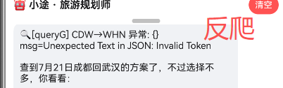
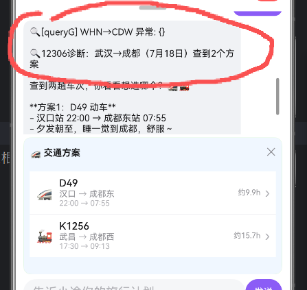

# 笔记：
- 初始信息：目的地，出发地，出发时间，游玩天数，经费

# 处理中：
- ✅ 工具错误原因不明，更多错误标记（已补工具参数校验、异常提示、失败原因透出）
- ~~日程插入混乱，不应该用上午下午这种强行卡死时间，应该根据在场景的开销时间+路上开销来推算时间够不够和能不能插入进去~~
- ~~“日程”顺序混乱！~~
- ✅ 顺序正确但时间错误（已按路程耗时、到站/回酒店锚点、酒店放行李耗时重算；仍需 DevEco 实机验证）

- ✅/⏳ "日程"修改混乱！（核心替换/删除/加点/上移下移已走确定性写工具；页面手动上移/下移/删除也会同步 agent；复杂多轮仍需 DevEco 实机观察）
- ✅ 记忆储存混乱，比如对话太多酒店会不知道是什么，这些确认的地点都应该储存下来给agent备忘而不是读对话（已同步 plan 到 agent，并把天数/预算/交通/酒店作为结构化状态；记忆压缩可后续增强）
- ✅ 因为火车会多次重试，可能出现我选了选项后又要问一遍的情况（已补工具调用去重、选择交通后结构化写入、停止/新对话中断）
- ~~小城市站名是编号而不是中文~~

# bug：
- ✅ 工具运行途中清理对话会错误！！（新对话/停止会打断后台工具链并阻止旧结果回写）
- ✅ 有时候地图上没有刚到和离开的火车站，没有回酒店（已自动补到达站、离开站、酒店出发/返回/取行李锚点）
- ✅ 当我的火车是第二天凌晨才到，游玩有可能是到了那天开始算？休息一天开始算？出发那天开始算？问清楚再画图（深夜/凌晨到达默认休息到 10:00，并提示用户可调整）
- ✅ agent和行程上显示的**单价不统一**（预算估算不再覆盖搜索得到的人均/票价，行程预算统一从结构化 plan 计算）
- ✅ 当地图初始化前拖太久会忘记“天数”（set_days 已作为写工具返回并保存 plan）
- ✅ 有时候会重复调用工具（同批次 action+参数去重；多轮 AI 再次触发仍需实机观察）
- ✅/⏳ _**拼劲全力也没有让反爬大人尽兴**_（已加 12306 60s 超时、诊断前缀、无结果/无价格说明、无日期默认 5 天后；如果被 ban 仍属于外部限制，演示时按提示换日期/站名或稍后重试）

- ✅ 对话全部说完再弹选项（快捷回复由页面在工具/AI 回复完成后生成，不作为 agent 正文输出）

# 需要优化
- ✅/⏳ 特殊地址会不好用（香港/Hong Kong/澳门/台北已加城市别名和静态中心兜底；东京/大阪/首尔/新加坡等境外城市可定位中心并提示覆盖限制，境外 POI/路线仍受高德服务限制）
- ✅ 应该可以自己手动调整行程，且每次我调整了ai都会有所反馈（POI 卡片已支持上移/下移/删除，统一走 agent 写工具，重算路线并在聊天中反馈同步）
- ✅ 不用的坐标点应该删掉（写工具后会清理空名、0 坐标、重复坐标点，再重算路线）
- ✅ 吃饭有时候选择较远的分店（餐饮搜索按当天最后有效地点/酒店/城市中心做距离排序，远分店降权）
- ✅ 当我切换页面回来后，导航页看见的是北京而不是我现在旅行计划的城市（主地图无 GPS/无足迹时读取保存的导游计划中心；导游执行中优先聚焦当前站）
- ✅ 酒店价格信息不够（酒店搜索展示高德商户参考价；缺失时明确“价格待确认”，加入计划后参与预算估算）
- ✅ 每次更新视角默认在城市中心，可能压根看不见行程走的区域（已根据行程 POI/路线 bounds 自动缩放）
- ✅ 有时候agent会使用用户现在定位，有时候不使用，应该统一（涉及当前位置/附近/离我近时先询问确认，不自动使用定位）
- ✅ 食物只推荐中餐（系统提示和快捷回复已改为优先当地小吃/特色餐厅/夜市等）

- ✅ 快捷选项应该是放在对话框上面的，不该是agent打出来（页面统一在输入框上方渲染上下文快捷回复）
- ✅ 没有用个人信息里面的偏好（偏好标签已转搜索关键词和排序加权，系统提示要求优先照顾用户偏好）

# 还需要观察：
- ✅/⏳ 这样才是用了火车查找工具！！！！已提高正确使用概率：无日期默认查 5 天后，12306 超时/异常会显示 🔍诊断，无价格会标“价格待查/需确认”，无实时结果会明确不要承诺余票；如果经常被 ban 成高德兜底，仍需按诊断换日期/站名或稍后实机重试。

- ✅ 预算显示也要检查（已增加预算占比堆叠条，并按已估总额显示分类占比）

